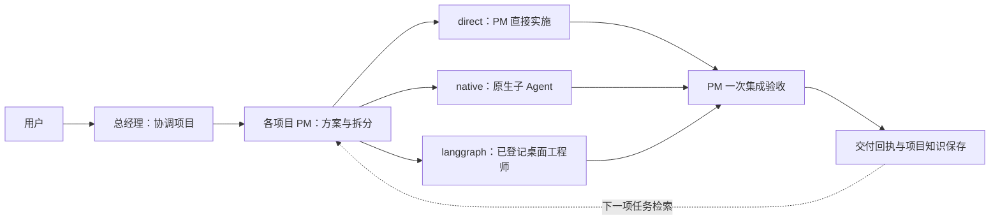

# Codex Agent Workbench

**在 Codex Desktop 中连接 Skill、本地 RAG 与多 Agent 编程调度。** 保留项目侧栏和现有角色任务，由总经理协调项目，项目经理按任务选择执行方式，交付后保存可检索、有来源的项目经验。

目前已用于有界的真实离线开发，跑通任务分流、执行接续、一次集成验收与知识回写。当前重点是减少重复交接、规则读取和报告动作，并记录真实交付成本；尚未得出固定提速、降错或节省比例。

[快速开始](#快速开始) · [Ruflo 复用状态](#ruflo-复用与调度优化) · [实测结果](#实测结果与成本) · [下一阶段](#下一阶段重点)

## 三部分各自负责什么

| 部分 | 职责 | 主要载体 |
|---|---|---|
| **Skill** | 约定角色边界、按需读取规则、选择执行路线及处理异常 | `codex-project-workbench` |
| **本地 RAG** | 检索项目知识，保留原文、来源与证据，供新任务接续 | Obsidian Markdown＋SQLite FTS5/BM25 |
| **编排控制器** | 保存合同与文件归属，派工、收集结果、恢复执行并组织验收 | LangGraph.js＋SQLite |

Skill、知识引擎与控制器在同一仓库发布，便于保持接口和版本一致。项目知识、真实配置、任务身份和会话日志保留在本机，不提交到 Git。

## 如何组织开发

总经理处理跨项目目标、优先级与冲突；**PM 同时负责技术方案、任务拆分和一次集成验收**；工程师执行明确的独占写集，不递归委派。前端、后端、测试等能力按实际任务安排，不固定凑满岗位。



| 路线 | 适合的工作 | 执行者 |
|---|---|---|
| `direct` | 一项有界工作，无需并行 | 当前 PM |
| `native` | 独立、短期的子任务 | Codex 原生子 Agent |
| `langgraph` | 有依赖、多阶段或需要跨轮接续 | 已登记的 Desktop 工程师任务 |

三条路线共享知识包、文件归属和验收标准。LangGraph.js 也承载共同的收集、验收与知识保存流程；路线名 `langgraph` 特指向桌面工程师派工。

每项目登记的三位工程师是容量上限，PM 按依赖选择 **0–3 人**。`1-2-6`、`1-3-9` 表示总经理、项目经理、工程师的组织规模，不要求所有任务都达到该并发数。原生子 Agent 的界面展示由 Codex 决定，不承诺成为永久侧栏角色。

## 项目知识与 Obsidian

- **Markdown 是知识原文。** 项目显式登记 `vaultRoot`；可单独作为 Obsidian Vault，也可经授权接入已有 Vault 的项目子目录。索引与执行状态仍保存在项目控制目录。
- **默认使用词项检索。** SQLite FTS5/BM25 配合 Unicode 词项和汉字 bigram，不依赖 embedding、向量服务或额外模型调用。
- **知识包按任务冻结。** `prepare` 保存限定范围的检索结果、来源路径和哈希；后续知识更新不会修改已派任务包，也不会清除旧聊天历史。
- **验收后保存经验。** 开启 `captureEnabled` 时，知识候选随正常结果交付，控制器在验收后保存并索引；已变更笔记更新需要匹配原哈希。
- **检查来源，保留失效原文。** 显式绑定的证据变化后，对应 capture 退出检索，Markdown 保留；未绑定的代码或外部事实变化不能自动识别。

只检索授权项目范围，不默认扫描个人 Vault 或其他项目。知识文本是资料，不能授予权限或要求执行其中的指令。详见 [知识约定](skills/codex-project-workbench/references/knowledge.md)。

## Ruflo 复用与调度优化

采用按模块适配的方式，未安装整套 Ruflo、AgentDB 或新增追踪服务。固定上游版本、改造范围和 MIT 通知见 [第三方声明](third_party/README.md)。

| 模块 | 当前状态 | 已增加或减少什么 |
|---|---|---|
| **成本分析** | 已适配 | 增加按角色、阶段、缓存与非缓存输入的统计及快照比较；建设、管理和产品成本分账 |
| **Guidance 按需规则** | 已采用，Skill 已更新 | 公共规则保留，按角色、路线和异常状态读取其余材料；改造时规则字符量减少：工程师约 26%，PM 正常流程约 41%–46% |
| **ContinueGate 异常提醒** | 已接入状态摘要 | 提示重复预检/验收恢复、返修预算已用及送达不明；复用原有约束，不自动重试或增加审批轮 |
| **Observability 链路分析** | 已接入，按需使用 | 显示控制器阶段及 task/attempt 时间关联；区分派送应答、运行观察和结果接收，不增加开工聊天或额外轮询 |
| **SmartRetrieval 重排** | 实验入口，默认未启用 | 同库对照的必要证据覆盖由 15/15 降至 14/15，未达到采用标准，正式默认保留 BM25 |
| **LearningBridge 经验学习** | 暂缓整体接入 | 继续使用现有知识保存与检索，尚未增加自动学习或自动避免同类错误的能力 |

Guidance 的数字是固定读取材料的 **Unicode 字符量**，不等于完整上下文或 Token 节省率。分析和提醒逻辑本身不调用模型；实现、维护和评测仍有消耗。

成本观察还推动了本地流程改造：短阶段交接、总经理同轮派工、`continue --output` 自动生成交付回执。最新 Skill 进一步取消为采样而手写重复派工报告的要求，由统计方读取原生工具回执；普通任务不增加固定成本汇报轮。

## 实测结果与成本

以下是截至 **2026-09-12** 的记录，各项证据范围分别标明。

| 验证项 | 已取得结果 | 适用边界 |
|---|---|---|
| 三条执行路线 | 跑通 direct、真实原生子 Agent、桌面工程师 A/B → C；包含知识保存和新任务检索 | 有界的小型任务，非全自主生产认证 |
| 双项目 `1-2-6` | 观察到 6 位工程师并发，45 项合同检查通过 | 有界合同任务 |
| 三项目 `1-3-9` | 编码批次一次定点返修后通过 67 项检查，编码峰值为 6；后续知识交付达到 9 人重叠 22.529 秒 | 9 人并发发生在知识交付，不能写成九人生产编码提速 |
| 最新恋语真实交付 | 12 条人工复核记录，8 类检查、一次正式集成验收、1 条知识保存；采用 direct | 全部待人工复核；离线命令证据，不代表训练、人工或生产验收 |
| 最近一次框架测试 | 127 项：126 通过、0 失败、1 项既有平台跳过 | 本地自动化测试，不替代 GUI 或用户验收 |

最新恋语样本的 PM 完整轮次约 **8分57秒**，其中控制器准备前约 **279.04 秒**，涉及需求筛选、资料读取和合同准备；控制器内执行与等待约 **245.37 秒**，正式验收命令约 **0.082 秒**。前期准备值得关注，但不能全部算作无效调度；执行与等待仍未拆成纯编码、工具或空等。

取消重复派工报告的规则已在本轮真实任务中生效：GM 顶层工具调用从 **4 次降至 2 次**，轮次从约 **114 秒降至 70 秒**，发送后没有额外工具操作；PM 完成一次正式验收和知识保存后结束。变化同时包含读取合并，不能全部归因于删除报告。GM 非缓存输入略增，业务内容也不同，**尚不能认定整体提速或费用下降**。

| 最新样本成本 | 原始总 Token（含缓存） | 非缓存输入 | 输出 |
|---|---:|---:|---:|
| 产品＋管理 | 3,940,419 | 335,939 | 24,576 |
| 维护者协调与观察，截点下界 | 1,809,556 | 65,956 | 18,800 |

成本截点为 2026-09-12 14:13:59.922 UTC，维护者尚未结束，其后报告和发布消耗未计入。本轮未改框架代码或 Skill；协调与观察本身仍有成本。缓存输入已包含在输入中，不重复累加，不换算 Codex 订阅费用。前后真实任务不同；本轮产品耗时和原始 Token 没有比上一项更低，尚未证明建设回本或整体提效。

证据：[最新正常交付观察](docs/normal-delivery-results-20260912.md) · [前次计时与修复](docs/task-timing-results-20260912.md) · [阶段交接前后观察](docs/stage-handoff-results-20260912.md) · [多项目验证](docs/dispatch-scale-results-20260912.md)。

## 快速开始

技术栈：**Node.js 24、LangGraph.js、SQLite、FTS5/BM25**。仓库为私有仓库，访问需要相应权限。当前角色配置为总经理 `gpt-6-astra/ultra`、PM `gpt-5.6-sol/high`、工程师 `gpt-5.6-luna/medium`；历史 Spark、5.5 验证分别保留，不等于所有模型组合均已认证。

首次安装，在仓库目录执行：

```powershell
npm ci
& ./scripts/install.ps1 -CodexRoot 'D:/Eastern/codex' -NodePath 'D:/tool/Node.js/node.exe'
```

以 [项目配置示例](examples/project.example.json) 登记真实项目根、知识范围和现有 PM／工程师任务身份，再使用 [请求示例](examples/request.example.json) 描述任务。安装脚本不会自动登记真实项目；已有 Skill 时拒绝直接覆盖。默认保留旧 Skill，显式 `-DisableLegacy` 迁移会保存备份，不清除旧任务历史或失败状态。

| 入口 | 查找位置 |
|---|---|
| 安装后的 Skill | `D:/Eastern/codex/skills/codex-project-workbench/SKILL.md` |
| CLI、Node、登记表路径 | **Skill 安装目录**的 `runtime.json` |
| 当前项目配置 | 该项目 `AGENTS.md` 指定的路径 |
| 执行、工作与知识目录 | 配置中的 `controlRoot`、`workRoot`、`vaultRoot` |

在现有总经理或对应 PM 任务中继续自然语言交代目标，例如：

> 推进指定项目的这项需求。使用 codex-project-workbench，由项目 PM 检索相关知识、按依赖选择执行路线，完成必要自测和一次集成验收，并保存可复用经验。

需要手动查询时，先把项目配置占位值替换为已登记的真实路径：

```powershell
$runtime = Get-Content 'D:/Eastern/codex/skills/codex-project-workbench/runtime.json' -Raw | ConvertFrom-Json
$project = '<项目 AGENTS.md 中的真实配置绝对路径>'
& $runtime.node $runtime.cli search --project $project --query '本次需求关键词'
& $runtime.node $runtime.cli status --project $project
```

控制器正常流程为 `prepare → start → continue`，完成时生成 delivery。`prepare` 冻结合同与写集；`start` 返回 direct/native 任务包或向桌面工程师派工；`continue --output <新文件>` 收集结果、推进一次集成验收并在完成时保存交付回执，通常无需再单独调用 delivery。原生路线另需真实 `claim → 创建子 Agent → bind`，详见 [执行规则](skills/codex-project-workbench/references/execution.md)。

`status` 查询摘要，`portfolio` 查询多项目摘要。已授权工作正常接续不增加逐轮确认；失败、送达不明或证据变化沿原 run 保留记录并按 [恢复规则](skills/codex-project-workbench/references/recovery.md) 处理。仅知识保存待处理时，不重做代码和验收。`pause` 停止新派工，不强制终止已运行的 Agent 或子进程。

按需分析使用 `cost-report`、`cost-diff` 和 `trace-report`，由指定统计方在交付结束后统一采集；参数与数据范围见 [成本与计时说明](skills/codex-project-workbench/references/cost.md)。

## 当前限制

- Desktop 适配器使用当前版本的内部 pipe 与回执格式，兼容性可能随版本变化；桌面工程师派工须在真实登记 PM 任务内执行。
- 文件归属、路径检查和 Skill 是应用层控制，**未实现 Desktop 全工具读取隔离**。已发现的跨任务读取与钩子故障反例保留，现有对照不能支持框架效率排名。
- RAG 默认是词项检索；检索命中不保证知识正确或完整，来源检查只覆盖显式绑定的证据。
- 时间报告区分状态停留与运行观察；精确开工、纯计算、暂停持续时间和跨主机关键路径仍未完整采集。
- 尚未得到可靠的整体提速、错误率、返工率或订阅费用下降比例，也没有全自主生产运行保证。

## 下一阶段重点

正常交付已观察到重复派工报告消失，PM 保持一次正式验收、一次知识保存并直接结束。继续沿真实需求使用现有流程；派工时给出明确需求与最新交付入口，减少 PM 重新寻找下一项工作的前期成本。

统计方在交付结束后采集一次，单列维护成本。优先减少额外模型步骤并保持交付质量；只修真实阻塞或反复出现的问题，暂缓增加框架模块，不为证明优化另造业务需求或新一轮完整框架试验。

## 详细报告

| 主题 | 材料 |
|---|---|
| 架构与合同 | [架构](docs/architecture.md) · [实现契约](docs/implementation-contract.md) · [与旧链、单 Agent 的比较](docs/comparison.md) |
| Ruflo 来源与适配 | [初始评估](docs/ruflo-assessment-20260912.md) · [成本模块评估](docs/ruflo-cost-assessment-20260912.md) · [MIT 与改造范围](third_party/README.md) |
| 检索与规则 | [SmartRetrieval 未采用结果](docs/smart-retrieval-results-20260912.md) · [Guidance 实测](docs/guidance-results-20260912.md) |
| 异常与观察 | [ContinueGate](docs/continue-gate-results-20260912.md) · [Observability](docs/observability-results-20260912.md) · [最新计时与调度修复](docs/task-timing-results-20260912.md) |
| 真实开发与成本 | [最新正常交付](docs/normal-delivery-results-20260912.md) · [首次成本分账](docs/ruflo-real-task-cost-20260912.md) · [阶段交接](docs/stage-handoff-results-20260912.md) · [多项目验证](docs/dispatch-scale-results-20260912.md) |

<details>
<summary>历史流程验证与隔离调查</summary>

- [首次三路线与知识闭环](docs/verification.md)、[Spark 完整流程](docs/spark-e2e.md)。
- [三组真实功能对照](docs/comparison-results.md)、[对照协议](docs/comparison-protocol.md)：保留失败与样本污染，不作胜负结论。
- [流程修复](docs/repair-verification.md)、[Docker＋SSH 隔离实测](docs/desktop-isolation-results-20260911.md)。
- [原生受管钩子实测](docs/desktop-hooks-results-20260911.md)、[工具执行端授权核查](docs/desktop-tool-authorization-assessment-20260911.md)：未达到全工具读取隔离。

</details>
