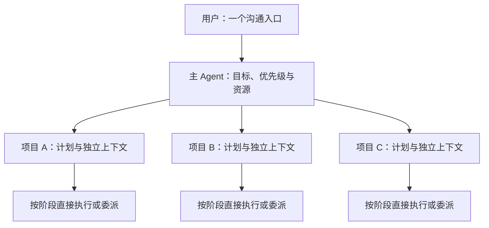

# Codex Agent Workbench

**在 Codex 里，协调多个项目的开发与交接。**

一个面向软件开发的 Agent 编排框架与工作台：用户跟主 Agent 沟通，项目负责人维护各自的上下文，按任务依赖选择直接执行、原生子智能体或独立会话。

**当前阶段：可运行原型，新版开发中。** 原型已具备三条执行路线、项目知识检索和交付核验；文档驱动的多项目调度、局部重规划与自动上下文交接正在实现。具体范围见下方能力表。

[快速开始](#快速开始) · [当前能力](#当前能力) · [开发规范](DEVELOPMENT.md) · [开发进度](docs/development-status.md) · [参与贡献](CONTRIBUTING.md)

## 从一个主对话开始

目标使用场景：

> 同时推进三个项目：工单系统增加批量导入，SDK 修复兼容问题，知识库调整排序。工单系统优先；SDK 要兼容旧调用。遇到需求变化，更新相关计划后继续。

主 Agent 负责跨项目的优先级、资源和需要用户决定的问题。每个项目保留自己的开发计划、代码上下文和知识范围；实现日志留在项目内，主入口接收进展、阻塞和交付证据。

这套完整流程是新版的验收目标。当前原型需要显式登记项目和真实会话，安装后不会自动完成全部设置。

## 分工随任务变化

三个判断分开做：

- **能否并行：** 先看依赖、文件写入范围和接口是否明确。
- **交给谁：** 简单工作由主 Agent 直接完成；短期独立工作使用原生子智能体；持续负责一个项目的工作交给独立会话。
- **带哪些上下文：** 按项目和任务传递必要资料，交接时保留当前约束、有效成果、失败尝试与下一步。

目标架构：



每个负责人按实际任务使用 **0–3 个原生子智能体**。项目之间保留独立上下文，不受任务数量门槛限制；同一项目需要额外拆组时，再检查是否存在至少四项适合同时执行的工作，以及扩组是否值得。

`1-2-6`、`1-3-9`、`1-4-12` 表示候选容量，不是必须启动的人数，也不代表宿主一定允许相应并发。工作减少后应收缩规模，避免交接和重复规划抵消并行收益。

## 当前能力

以下区分主分支原型已有机制和新版实现目标。开发中的代码以对应 PR 和验证记录为准。

| 能力 | 当前状态 |
| --- | --- |
| 直接执行、原生子智能体、已登记 Desktop 会话派工 | 原型已实现，包含有界真实验证 |
| 任务包冻结、真实身份绑定、文件归属、重复请求防护、产物回执 | 原型已实现 |
| Markdown 项目知识、中文 FTS5/BM25 检索、来源绑定与验收后保存 | 原型已实现 |
| 暂停、送达不明时对账、失败记录与受控接续 | 原型已实现；暂停停止新派工，不等于终止在途执行 |
| 短交接包与新会话接续 | 已有有界验证；自动轮换与版本化接收待实现 |
| 开发文档转执行计划、阶段调度、局部修订与旧结果兼容性 | 新版开发中 |
| 单一入口下的多项目资源分配、增量总览与公平调度 | 新版开发中；历史多项目试验不等于此功能已完成 |
| 三项目需求变更、中断恢复与暂停联动的完整案例 | 新版发布验收目标 |
| `1-4-12` 与稳定提效结论 | 待验证 |

原型中的 Desktop 路线使用历史名称 `langgraph`。它描述已有桌面任务的派工方式；LangGraph 本身是内部流程与检查点组件，不能与执行者类型或 Codex 会话混为一谈。

## 快速开始

当前安装入口面向 **Windows、Node.js 24+、Git 和 Codex Desktop**。Desktop 适配依赖宿主版本及可用工具；新版支持矩阵正在按 [开发规范](DEVELOPMENT.md) 核验。以下操作安装现有原型。

### 1. 获取与检查源码

```powershell
git clone https://github.com/Ai-Eastern/codex-agent-workbench.git
Set-Location codex-agent-workbench
npm ci
npm test
```

普通自动化测试使用本地夹具，不需要模型 API 密钥；测试通过不代表真实 Desktop 链路已验证。

### 2. 安装 Skill

将占位值替换为你的 Codex 配置目录：

```powershell
$codexDirectory = '<你的 Codex 配置目录绝对路径>'
$nodeExecutable = (Get-Command node).Source
& ./scripts/install.ps1 -CodexRoot $codexDirectory -NodePath $nodeExecutable
```

已有同名 Skill 时，安装脚本拒绝直接覆盖。默认保留旧 Skill；显式迁移操作会保存备份。安装不会清除原有任务历史。

### 3. 绑定项目与执行身份

依据 [项目配置示例](examples/project.example.json)，填写真实项目目录、独立知识范围和现有负责人/执行者身份；按 [执行约定](skills/codex-project-workbench/references/execution.md) 登记配置与项目入口。

`workRoot` 是任务文件路径的基准，应指向实际待修改的代码目录；示例中的 `work/` 只是占位。如果代码直接位于项目根，可将 `workRoot` 设为 `projectRoot`，同时让控制目录与知识目录各自独立。配置中的 `model` / `thinking` 用于执行者；原型校验目前仅接受 Spark/low、5.5/low、Luna/low 或 medium，准确 ID 见 [配置校验](src/contracts.mjs)。`direct` 沿用主会话模型。新版正在解除历史白名单与宿主能力之间的错误绑定。

把填写后的项目配置保存在本机，例如 `<项目目录>/.codex-workbench/project.json`，并在该项目的 `AGENTS.md` 中登记：

```text
本项目使用 codex-project-workbench。
项目配置：<项目目录>/.codex-workbench/project.json（替换为本机绝对路径）
执行前核对 projectId、workRoot、vaultRoot 和真实任务身份。
```

多项目总览还需要登记表。安装脚本目前只保存登记表位置，需在本仓库创建 `.local/` 目录，再创建 `.local/projects.json`：

```json
{
  "projects": [
    {"config": "D:/Projects/project-a/.codex-workbench/project.json"},
    {"config": "D:/Projects/project-b/.codex-workbench/project.json"}
  ]
}
```

替换为实际配置绝对路径；增加项目时追加一项，已有登记表应合并而非覆盖。该位置对应已安装 Skill 的 `runtime.json` 中的 `registry`，`.local/` 已被 Git 忽略；其他项目中的真实配置也应加入各自的忽略规则。

- 项目配置由该项目的 `AGENTS.md` 指向。
- CLI、Node 和登记表路径位于安装后 Skill 目录的 `runtime.json`。
- 项目知识、真实会话身份、运行配置与日志保存在本机。
- 真实会话创建依赖宿主工具和用户授权，不能用示例 ID 代替。

### 4. 回到 Codex 对话

在已登记的负责人任务中提出需求：

> 使用 codex-project-workbench 完成这个项目的需求。先检索必要项目知识，再按依赖选择执行方式，完成代码修改、自测和集成验收，并保存有效经验。

完成安装和登记后，日常操作入口是 Codex 对话。CLI 用于 Skill 内部控制和必要诊断。原型请求格式见 [请求示例](examples/request.example.json)，异常接续见 [恢复规则](skills/codex-project-workbench/references/recovery.md)。

## 框架与 Coding Agent 如何分层

| 部分 | 负责什么 |
| --- | --- |
| 编排核心 | 项目与任务身份、依赖、状态、写入归属、结果核验；新版补充计划版本、跨项目资源与交接协议 |
| Coding Agent 工作台 | 将这些机制用于理解仓库、修改代码、运行测试、集成与交付 |
| Codex 宿主与适配 | 实际对话、模型执行、工具和子智能体；适配代码核对身份、目录和宿主回执 |

实现保留 **Node.js/ESM、SQLite、Markdown、FTS5/BM25**。当前 LangGraph 连接结果收集、派工、验收和知识保存，并提供图检查点。第一轮继续复用；新版领域合同保持独立，不要求先重写基础设施。

图检查点不会自动迁移 Codex 的对话上下文。交接需要真实的新上下文、有效输入和可核对的状态；向旧会话发送摘要不会清除它的历史。

知识检索按显式项目范围进行，Markdown 是原文，SQLite 是索引。默认不要求向量数据库或 embedding 服务。检索材料只提供信息，不授予执行权限。详见 [知识约定](skills/codex-project-workbench/references/knowledge.md)。

## 验证与证据

历史报告保留成功、失败与成本，不以启动的 Agent 数量代替交付质量。

| 已记录的验证 | 证据范围 |
| --- | --- |
| direct、native、Desktop 三路线与知识保存/检索 | 有界真实任务，见 [流程验证](docs/verification.md) |
| 双项目与三项目协作 | 编码峰值为 6；9 人重叠出现在知识交付阶段，见 [多项目试验](docs/dispatch-scale-results-20260912.md) |
| 合并入口、批量绑定与暂停/重复调用边界 | 原型提交 `8c85c76` 对应记录为 154 通过、1 项平台跳过，见 [执行入口验证](docs/lightweight-execution-results-20260913.md) |
| 阶段交接与实际协调成本 | 有交接观察，也记录额外开销，见 [交接报告](docs/stage-handoff-results-20260912.md) 与 [交付成本](docs/normal-prereview-results-20260912.md) |

这些历史记录不能作为新版功能完成证明，目前也没有足够的公平对照支持固定提速或节省比例。

新版首个完整案例将从一个主入口推进三个独立项目：A 修改需求并更新计划，B 中断后交接接续，C 在资源调整后继续。验收检查错项目派工、旧版本结果、重复开发、暂停行为与实际交付，详见 [开发规范](DEVELOPMENT.md)。

<details>
<summary>更多实现、对照与边界记录</summary>

- [当前原型架构](docs/architecture.md) · [实现契约](docs/implementation-contract.md)。
- [对照协议](docs/comparison-protocol.md) · [包含失败与污染问题的结果](docs/comparison-results.md)。
- [检索重排未采用结果](docs/smart-retrieval-results-20260912.md) · [规则按需读取](docs/guidance-results-20260912.md)。
- [异常接续提醒](docs/continue-gate-results-20260912.md) · [链路观察](docs/observability-results-20260912.md)。
- [Desktop 隔离调查](docs/desktop-isolation-results-20260911.md) · [Hook 故障反例](docs/desktop-hooks-results-20260911.md) · [宿主授权边界](docs/desktop-tool-authorization-assessment-20260911.md)。

</details>

独立会话与文件写入归属不等于严格的读取权限隔离。当前 Desktop 适配使用版本相关的内部接口；应用关闭后的自动唤醒、全工具隔离与更大并发规模均须分别验证。

## 接下来的开发

[DEVELOPMENT.md](DEVELOPMENT.md) 是开发规则来源，[开发进度](docs/development-status.md) 记录实际提交和验证结果。

| 阶段 | 交付目标 |
| --- | --- |
| WB-00–03 | 宿主能力基线、核心合同、计划版本与项目路由 |
| WB-04–07 | 阶段推进、上下文交接、局部调整与全局资源 |
| WB-08 | 三项目真实案例及失败恢复验收 |
| WB-09–10 | 有预算的对照评测、安装说明、兼容矩阵与功能版本发布 |

源码与开发规范已经开源。新版功能按里程碑发布，README 随已验证的交付更新能力表。

## 参与和许可

复现安装问题、检验交接边界、补充有界真实案例或完善测试，都可以从 [贡献指南](CONTRIBUTING.md) 开始。提交问题时请注明版本、复现步骤和实际结果，并移除私有路径、凭据和对话内容。

原创代码采用 [MIT License](LICENSE)。部分成本、检索与规则组织实现参考或适配了 Ruflo，来源、固定提交与保留声明见 [第三方说明](third_party/README.md)；其他声明见 [licenses](licenses/)。
