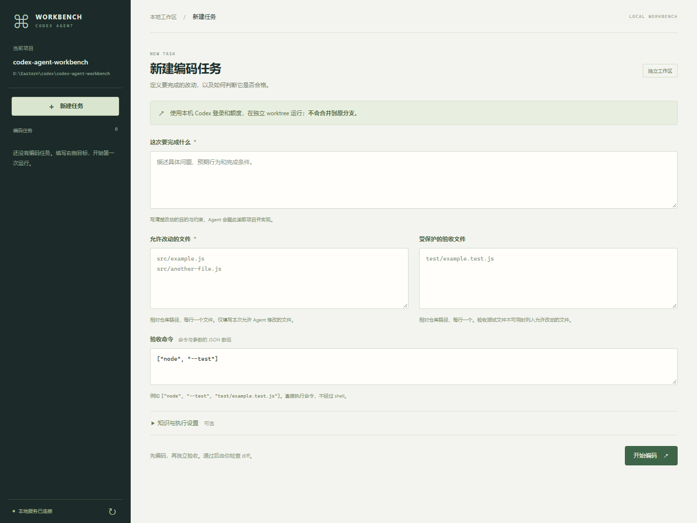

# Codex Agent Workbench

**在自己的 Git 仓库里发起编码任务，得到经过独立命令验收、可人工评审的补丁。**

填写目标、允许修改的文件和验收命令，工作台创建独立 Git worktree，调用本机 Codex CLI 编码，再由控制器运行验收。失败保留，修复需要具体原因；通过后提供 diff 与产物哈希，由你决定如何合并。

[启动工作台](#启动工作台) · [命令行](#命令行使用) · [能力与证据](docs/evidence-map.md) · [验证记录](docs/verification-20260921.md) · [English](README.en.md)

当前已完成一次真实 Codex CLI 改码 → 独立验收 → 补丁交付的小任务验证。它证明该链路跑通，不代表模型成功率或性能优势。**项目当前仍为私有，原创代码保留所有权利，尚未正式开源。** 见 [LICENSE](LICENSE)。

## 启动工作台

需要 **Node.js 24+、Git、已安装且可用的 Codex CLI**。目标仓库需要已有提交，验收所需工具与依赖由使用者准备。工作台沿用本机 Codex 登录与额度，不要求登记 Desktop 任务。

在本项目目录执行，替换两个示例路径：

~~~sh
npm ci
npm start -- --repo "D:/projects/my-app" --state "D:/workbench-state/my-app"
~~~

--repo 指向目标 Git 仓库根目录，--state 必须位于该仓库外。打开终端打印的地址，默认 http://127.0.0.1:4317。启动服务只加载页面，**点击“开始编码”才会调用 Codex 并消耗额度**。

端口冲突时追加 --port 4318；无法自动定位原生 Codex 程序时可追加 --executable "D:/tools/codex.exe"。Windows 支持识别部分 npm 安装包装器，不通过 shell 拼接提示词。

1. **填写目标**：具体问题、预期行为和完成条件。
2. **指定允许改动的文件**：仓库相对路径，使用 /，每行一个精确文件；不填写目录或 glob。
3. **指定验收**：命令使用 argv JSON，例如 ["node", "--test", "test/example.test.js"]。需要保持不变的测试文件单独列入“受保护的验收文件”，不可同时允许修改。
4. **开始编码**：查看实际状态、近期事件、Agent 总结与验收结果；通过哈希核验后可展开验收命令的完整 stdout / stderr，执行中可以发送停止请求。
5. **处理结果**：验收失败后填写具体原因，明确发起一次修复；进入“待人工评审”后查看或下载 diff。

新 worktree 默认从目标仓库的 **HEAD 提交**创建，不包含原工作区未提交内容，也不会复制被忽略的 node_modules 或本地环境文件。工作台不自动提交、合并或推送。

## 先跑一次真实小任务

也可以先用独立生成的小仓库检查真实执行链路：

~~~sh
npm run smoke:agent -- --output .local/real-smoke
~~~

**该命令会使用真实 Codex 登录和额度**，单次执行预算为 120 秒；输出目录必须尚不存在。它在新建仓库中修复标签规范化函数，运行固定 Node 验收，并保存 summary.json 和任务证据。它不是零模型演示，也不会在 CI 中自动调用模型。

已使用同一执行链路的临时脚本观察到一次真实调用进入 READY_FOR_REVIEW：只修改允许的实现文件，两条固定断言通过，原仓库保持不变。新增 smoke:agent 入口已通过帮助与安全拒绝检查，未再次调用模型。该次真实调用沿用本机模型配置，未观测到服务端实际模型标识。完整边界见 [验证记录](docs/verification-20260921.md)。

## 一次改动如何交付

~~~mermaid
flowchart LR
    T[目标 · 文件范围 · 验收命令] --> W[从基准提交创建 worktree]
    W --> C[真实 Codex CLI 编码]
    C --> I[检查文件范围与验收文件哈希]
    I --> A[控制器运行验收命令]
    A -->|通过| P[绑定哈希的补丁 · 人工评审]
    A -->|失败| F[保留失败记录]
    F -->|明确原因 · 一次修复预算| C
~~~

| 当前行为 | 实现 |
|---|---|
| 提示词走 stdin，保存 JSONL 与 stderr；成功退出和完成事件同时满足才算执行完成 | [Codex 执行器](src/codex-executor.mjs) |
| 每任务一个 detached worktree，精确文件白名单，导出含二进制改动的补丁 | [Git 工作区](src/git-workspace.mjs) |
| 控制器运行固定验收，校验保护文件与执行结果，绑定产物哈希 | [本地控制器](src/local-runner.mjs)、[验收进程](src/local-check.mjs) |
| 保留失败，明确修复创建新 attempt；重复相同任务 ID 不自动重跑模型 | [持久工作流](src/workflow.mjs) |
| 从明确选中的 Markdown 检索项目知识并冻结任务上下文 | [知识模块](src/knowledge.mjs) |

当前新入口每任务一个编码执行者，使用有界 direct 路线；没有启用自动知识回写。既有 native / LangGraph Desktop 调度另见 [Desktop 指南](docs/desktop-guide.md)，不作为新网页已具备多 Agent 并行的承诺。

## 命令行使用

参照 [请求示例](examples/agent-task.example.json) 修改目标、文件和命令。示例路径不是任意仓库都有的文件；验收与知识文件应存在于所选基准提交。CLI 请求需要稳定 id，网页自动生成 ID。

~~~sh
npm run agent -- run --repo "D:/projects/my-app" --state "D:/workbench-state/my-app" --request examples/agent-task.example.json
npm run agent -- status --state "D:/workbench-state/my-app" --run normalize-labels
npm run agent -- diff --state "D:/workbench-state/my-app" --run normalize-labels
~~~

run 可用 --ref 选择基准提交或分支。请求的 model、reasoning 可选，省略时不覆盖本机配置；timeoutMs 默认 600000。

~~~sh
npm run agent -- repair --state "D:/workbench-state/my-app" --run normalize-labels --reason "修复验收记录中出现的边界输入错误"
npm run agent -- continue --state "D:/workbench-state/my-app" --run normalize-labels
~~~

repair 仅适用于明确验收失败，预算为一次。continue 只接续 EXECUTED / ACCEPTING 阶段的验收，或复核已有交付，不会重启被中断的编码。重复同一 ID 返回已有状态，改变该 ID 对应的合同会被拒绝。BLOCKED 与崩溃后的残留锁需要先检查，不会被自动重试或删除。

## 记录与边界

状态保存在 --state/runs/<任务ID>/：run.json、阶段 events.jsonl、候选 worktree、每次 attempt 的原始事件/stderr/最终消息、执行结果、control/ 验收记录，以及通过后的 candidate.patch。网页发起的任务另有 activity.jsonl；页面展示近期事件，全量已保留记录以磁盘文件为准。原始日志可能含源码、提示词和工具输出，分享前需自行核对。

- worktree、文件白名单和哈希检查不是额外的 OS 安全沙箱，也不保证隐藏测试不可读。调用 Codex 时使用 workspace-write。
- 保护文件在检查点做哈希校验，不是不可篡改存储或持续写入拦截。忽略规则覆盖的非白名单运行缓存不计入补丁检查。
- 原仓库 HEAD 与候选 HEAD 的变化会被检测；任务期间原工作区未提交内容的变化尚未全量检测。
- 本地 API 有 Host、同源与会话 token 校验，面向单机，不提供公网账户、团队权限或容器隔离。
- 验收通过仍需人工评审。当前没有可公开重算的模型成功率、提速或成本优势结论。

## 补充机制检查

~~~sh
npm test
npm run evaluate -- --output .local/mechanism-check-001
npm run demo -- --report .local/mechanism-check-001/report.json --port 4318
~~~

Evidence Lab 是次级只读入口：公开固定补丁、零模型调用，运行真实控制器与 Node 验收。机制断言数不是模型成绩，其截图也不代表实际编码任务。每次检查使用新输出目录。

[技术证据地图](docs/evidence-map.md) · [验证记录](docs/verification-20260921.md) · [产品方向](docs/product-direction.md) · [未来评测协议](docs/evaluation-protocol.md) · [第三方声明](third_party/README.md)
