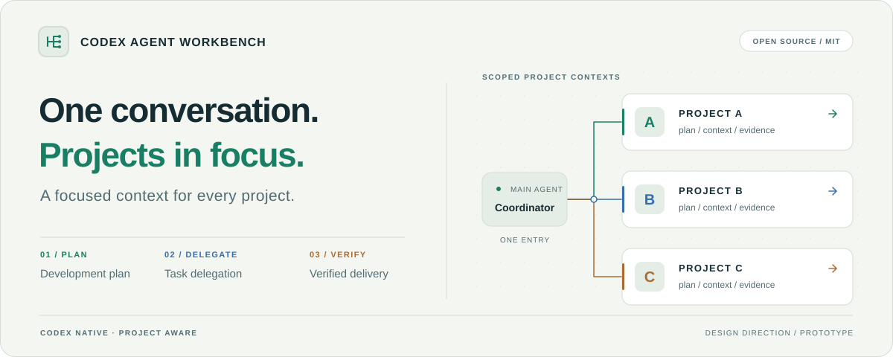

<picture>
  <source media="(prefers-color-scheme: dark)" srcset="./docs/assets/workbench-hero-dark.svg">
  <source media="(prefers-color-scheme: light)" srcset="./docs/assets/workbench-hero-light.svg">
  
</picture>

<h1 align="center">Codex Agent Workbench</h1>

<p align="center"><strong>English</strong> · <a href="./README.zh-CN.md">简体中文</a></p>

<p align="center">
  <strong>One conversation. Every project in focus.</strong><br>
  Codex-native orchestration · Adaptive delegation · Scoped context · Traceable handoffs
</p>

<p align="center">
  <a href="./LICENSE"></a>
  <a href="./package.json"></a>
  <a href="#get-started"></a>
  <a href="#get-started"></a>
  <a href="./docs/development-status.md"></a>
</p>

<p align="center">
  <a href="#get-started"><strong>Get started</strong></a> ·
  <a href="#capabilities">Capabilities</a> ·
  <a href="./DEVELOPMENT.md">Development spec</a> ·
  <a href="#roadmap">Roadmap</a> ·
  <a href="./CONTRIBUTING.md">Contribute</a>
</p>

A coding workflow and agent orchestration framework built around Codex. Talk to a lead agent while project leads keep their own context and choose between direct execution, native subagents, and separate conversations.

> **Runnable prototype · Multi-project upgrade in development**<br>
> The prototype already supports three execution routes, project knowledge retrieval, and verified delivery receipts. Versioned development plans, adaptive multi-project scheduling, and automatic context handoffs are being built. The header illustrates the design direction; see [Capabilities](#capabilities) for the current scope.

## Start with one conversation

The target workflow:

> Work on three projects: add bulk import to the ticketing app, fix backward compatibility in the SDK, and stabilize search ranking. Prioritize the ticketing app. Keep existing SDK callers working. Update the relevant plan when requirements change.

The coordinator handles priorities, resources, and decisions that need your input. Each project keeps its own plan, code context, and knowledge scope. Detailed execution logs stay with the project; the main conversation receives progress, blockers, and delivery evidence.

This complete scenario is a release acceptance target. The current prototype requires explicit project registration and real conversation identities.

## Let the work determine the team

<table>
  <tr>
    <td width="33%" valign="top">
      <sub>01 / DEPENDENCIES</sub><br>
      <strong>What can run in parallel?</strong><br><br>
      Establish dependencies, shared interfaces, and file ownership before scheduling independent work.
    </td>
    <td width="33%" valign="top">
      <sub>02 / DELEGATION</sub><br>
      <strong>Who should do the work?</strong><br><br>
      Execute small tasks directly, delegate bounded work to subagents, and use separate conversations for continuing projects.
    </td>
    <td width="33%" valign="top">
      <sub>03 / CONTEXT</sub><br>
      <strong>What should a handoff carry?</strong><br><br>
      Pass current constraints, valid results, failed attempts, and next steps. Load detailed evidence when needed.
    </td>
  </tr>
</table>

Each lead uses **0–3 native subagents** according to the task. Separate projects keep separate contexts regardless of task count. Additional execution groups within a project require at least four suitable concurrent work items, available resources, and a reason to expect the coordination cost to pay off.

`1-2-6`, `1-3-9`, and `1-4-12` describe candidate capacities, not staffing targets or guaranteed host limits. Reduce the team as work narrows.

## Capabilities

This table separates the prototype on the default branch from the new workflow. Implementation branches and their verification records may be ahead of the default branch.

| Capability | Status |
| --- | --- |
| Direct execution, native subagents, and dispatch to registered Desktop conversations | Implemented in the prototype; bounded live validation recorded |
| Frozen task packets, identity binding, file ownership, duplicate-request protection, and artifact receipts | Implemented |
| Markdown knowledge, Chinese-aware FTS5/BM25 retrieval, source binding, and capture after acceptance | Implemented |
| Pause, uncertain-delivery reconciliation, failure records, and controlled continuation | Implemented; pause stops new dispatch, not necessarily in-flight work |
| Short handoffs and continuation in a new conversation | Bounded validation exists; automatic rotation and versioned acceptance are planned |
| Development plans, phase scheduling, local revisions, and stale-result compatibility checks | In development |
| Multi-project resource allocation, incremental status, and fair scheduling from one entry point | In development; earlier multi-project trials do not establish completion |
| A three-project scenario with requirement changes, interruption recovery, and scoped pauses | Release acceptance target |
| `1-4-12` and repeatable efficiency improvements | Not yet validated |

The prototype calls its Desktop route `langgraph`. That is a legacy route name. LangGraph itself is an internal workflow and checkpoint component, distinct from the execution host and conversation identities.

## Get started

The current installation path targets **Windows, Node.js 24+, Git, and Codex Desktop**. Desktop integration depends on the host version and available tools. The new compatibility matrix is being established under the [development spec](DEVELOPMENT.md).

### 1. Clone and check the source

```powershell
git clone https://github.com/Ai-Eastern/codex-agent-workbench.git
Set-Location codex-agent-workbench
npm ci
npm test
```

The automated suite uses local fixtures and does not require a model API key. Passing tests do not establish live Desktop compatibility.

### 2. Install the Skill

Replace the placeholder with your Codex configuration directory:

```powershell
$codexDirectory = '<absolute path to your Codex config directory>'
$nodeExecutable = (Get-Command node).Source
& ./scripts/install.ps1 -CodexRoot $codexDirectory -NodePath $nodeExecutable
```

The installer refuses to overwrite an existing Skill with the same name. Legacy Skills are kept by default; explicit migration creates backups. Installation does not clear conversation history.

### 3. Register projects and identities

Start from [the project configuration example](examples/project.example.json). Set real project paths, a scoped knowledge directory, and real lead/worker conversation identities. See [the execution contract](skills/codex-project-workbench/references/execution.md).

`workRoot` is the base directory for task file paths. Point it at the code you intend to modify; the example's `work/` is only a placeholder. It may equal `projectRoot` when the code lives there, while control and knowledge directories remain separate.

The prototype currently accepts only Spark/low, 5.5/low, and Luna/low or medium for its executor configuration; exact IDs are in [configuration validation](src/contracts.mjs). The direct route retains the lead conversation's model. Removing this historical allowlist is part of the ongoing upgrade.

Save the project configuration locally, for example at `<project>/.codex-workbench/project.json`, and add its location to that project's `AGENTS.md`:

```text
This project uses codex-project-workbench.
Project configuration: <absolute project path>/.codex-workbench/project.json
Before execution, verify projectId, workRoot, vaultRoot, and real conversation identities.
```

For a portfolio view, create `.local/` in the Workbench clone and add `.local/projects.json`. The installer records this location but does not create the registry:

```json
{
  "projects": [
    {"config": "D:/Projects/project-a/.codex-workbench/project.json"},
    {"config": "D:/Projects/project-b/.codex-workbench/project.json"}
  ]
}
```

Use real absolute paths. Append to an existing registry rather than replacing it. The installed Skill's `runtime.json` records its `registry` location, CLI path, and Node executable. Workbench ignores `.local/`; keep real configuration, identities, and logs out of other project repositories as well.

### 4. Return to Codex

In a registered lead conversation:

> Use codex-project-workbench to implement this change. Retrieve the relevant project knowledge, choose an execution route based on dependencies, make the change, run checks and integration acceptance, and retain useful findings.

After setup, the day-to-day interface is the Codex conversation. The CLI provides internal control and diagnostics. See [request examples](examples/request.example.json) and [recovery rules](skills/codex-project-workbench/references/recovery.md) for the prototype's contracts.

## Framework, workflow, and host

| Layer | Responsibility |
| --- | --- |
| Orchestration core | Project/task identity, dependencies, state, file ownership, and result validation; the upgrade adds plan versions, global resources, and handoff protocols |
| Coding workflow | Apply those mechanisms to repository analysis, code changes, tests, integration, and delivery |
| Codex host and adapter | Real conversations, model execution, tools, and subagents; the adapter verifies identities, directories, and host receipts |

The implementation uses **Node.js/ESM, SQLite, Markdown, and FTS5/BM25**. LangGraph currently connects collection, dispatch, acceptance, and knowledge capture, with graph checkpoints. The first upgrade reuses this implementation while keeping new domain contracts independent of its internal types.

A graph checkpoint does not migrate a Codex conversation. A handoff still needs a real context boundary, valid inputs, and verifiable state. Sending a summary to an existing conversation does not erase its history.

Knowledge retrieval is project-scoped. Markdown holds the source text; SQLite holds the index. The default path does not require a vector database or embedding service. Retrieved content is information, not execution authority. See [knowledge rules](skills/codex-project-workbench/references/knowledge.md).

## Evidence, with boundaries

Historical reports preserve failures and coordination costs alongside successful runs.

| Recorded validation | Scope |
| --- | --- |
| Three execution routes and the knowledge capture/retrieval loop | Bounded live tasks; [workflow report](docs/verification.md) |
| Two- and three-project coordination | Coding concurrency peaked at 6; the 9-worker overlap occurred during knowledge delivery; [scale report](docs/dispatch-scale-results-20260912.md) |
| Combined entry points, bulk binding, pause, and duplicate-call handling | The record for prototype commit `8c85c76` reports 154 passing tests and 1 platform skip; [execution report](docs/lightweight-execution-results-20260913.md) |
| Stage handoffs and coordination overhead | Handoff observations include added costs; [handoff report](docs/stage-handoff-results-20260912.md) and [delivery costs](docs/normal-prereview-results-20260912.md) |

These records do not establish that the new workflow is complete. There is no adequate controlled evidence for a fixed speedup or cost-saving percentage.

The first full acceptance case will run three separate projects from one coordinator: revise A's requirements, resume B after an interruption, and let C progress after resource changes. It checks project routing, stale results, duplicate work, pause behavior, and actual delivery. See the [development spec](DEVELOPMENT.md).

<details>
<summary>Implementation notes, comparisons, and boundary investigations</summary>

- [Prototype architecture](docs/architecture.md) · [Implementation contract](docs/implementation-contract.md).
- [Comparison protocol](docs/comparison-protocol.md) · [Results including failures and contamination](docs/comparison-results.md).
- [Retrieval reranking not adopted](docs/smart-retrieval-results-20260912.md) · [On-demand rules](docs/guidance-results-20260912.md).
- [Continuation advice](docs/continue-gate-results-20260912.md) · [Trace analysis](docs/observability-results-20260912.md).
- [Desktop isolation](docs/desktop-isolation-results-20260911.md) · [Hook failure cases](docs/desktop-hooks-results-20260911.md) · [Host authorization boundaries](docs/desktop-tool-authorization-assessment-20260911.md).

</details>

Separate conversations and write ownership are not a strict read-access sandbox. The Desktop adapter uses version-sensitive internal interfaces. Offline wakeup, full-tool isolation, and larger concurrency limits require their own validation.

## Roadmap

[DEVELOPMENT.md](DEVELOPMENT.md) defines the implementation contracts; [development status](docs/development-status.md) tracks commits and actual verification.

| Stage | Deliverable |
| --- | --- |
| WB-00–03 | Host baseline, core contracts, plan versions, and project routing |
| WB-04–07 | Phase execution, context handoffs, local revisions, and global resources |
| WB-08 | A live three-project acceptance case, including failure recovery |
| WB-09–10 | Budgeted comparative evaluation, installation, compatibility, and release |

The source and development specification are open. Capability claims will follow verified milestones. The detailed specification and historical reports are currently in Chinese.

## Contributing and license

Help reproduce installation issues, exercise handoff boundaries, contribute bounded real-world cases, or improve tests. Start with [the contribution guide](CONTRIBUTING.md). Include versions, reproduction steps, and observed results; remove private paths, credentials, and conversation content.

Original code is licensed under [MIT](LICENSE). Selected cost, retrieval, and rule-organization mechanisms reference or adapt Ruflo; see [third-party attribution](third_party/README.md) for pinned sources and retained notices, and [licenses](licenses/) for other notices.
