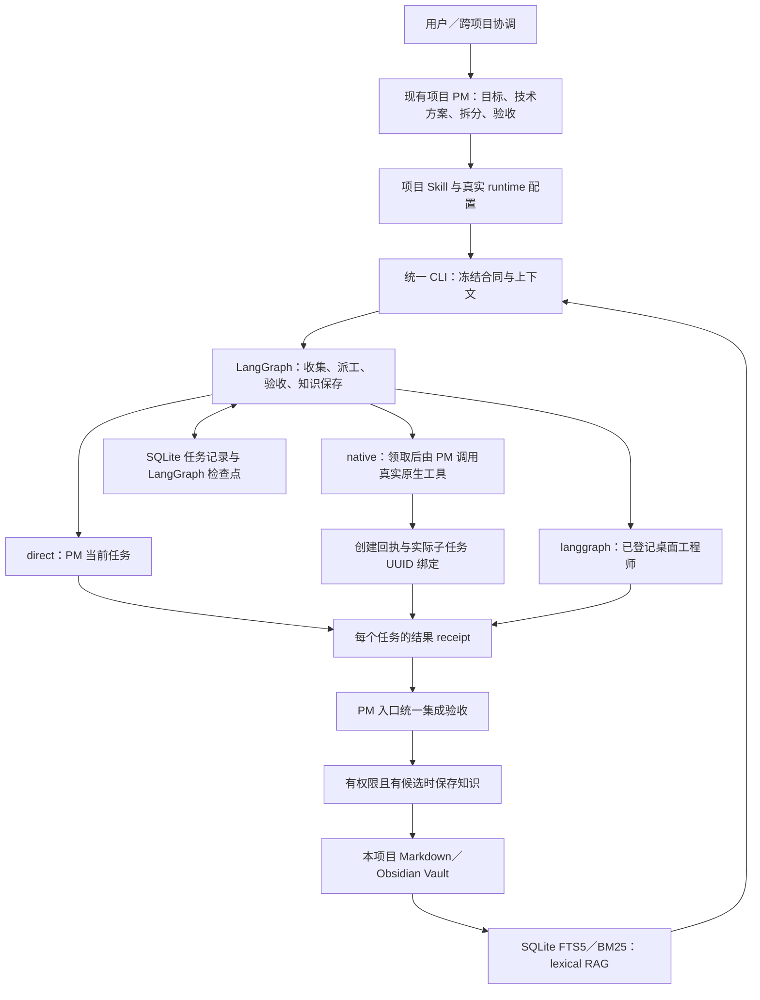

# 架构与数据流

本地 Node.js 24 控制器通过一个 CLI 入口管理项目任务。Codex Skill 决定何时读取知识、选择路线和接续工作；LangGraph.js 驱动状态推进；SQLite 分别保存执行记录和可重建的全文索引。执行仍发生在现有 Codex 任务或真实原生子 Agent 中。

## 角色与执行关系

PM 同时承担原 TL 的常规技术职责。工程师不递归委派。跨项目协调通过登记表和 `portfolio` 摘要分配目标，各 PM 选择自己的路线，不共用未授权的项目知识或身份。

## 代码与持久数据

| 组件 | 负责内容 |
| --- | --- |
| [src/contracts.mjs](../src/contracts.mjs) | 配置、请求、项目身份、路径、文件冲突和依赖校验 |
| [src/cli.mjs](../src/cli.mjs) | 唯一命令入口，路由到准备、执行、查询、知识或多项目摘要 |
| [src/workflow.mjs](../src/workflow.mjs) | 冻结任务包、文件预留、状态图、接收结果、独立验收和 capture |
| [src/desktop.mjs](../src/desktop.mjs) | 通过当前 Desktop 内部 pipe 读取和派送已登记任务 |
| [src/knowledge.mjs](../src/knowledge.mjs) | 授权 Markdown 扫描、中文词项、FTS5/BM25、证据哈希、去重和冲突保护 |
| [skills/codex-project-workbench](../skills/codex-project-workbench/SKILL.md) | PM 和工程师在 Codex 中遵守的使用约定 |

项目配置中的 `projectRoot` 是授权项目根目录，`workRoot` 指向本批工作文件范围，`controlRoot` 保存运行数据，`vaultRoot` 保存项目知识；三者必须在项目根目录内并满足隔离约定。公开模板为 [examples/project.example.json](../examples/project.example.json)，真实路径和任务映射由本机项目 `AGENTS.md` 指向。

| 数据 | 位置 | 性质 |
| --- | --- | --- |
| 请求、任务状态、事件、文件归属、LangGraph 检查点 | `controlRoot/state.sqlite` | 持久执行记录；不应当作可随意删除的知识缓存 |
| 冻结任务包 | `controlRoot/runs/<runId>/packets/` | 目标、独占文件、依赖、知识来源和上下文哈希 |
| 工程师结果 | `controlRoot/runs/<runId>/results/` | 与 run、task、attempt 绑定的实际交付 receipt |
| 集成验收证据 | `controlRoot/runs/<runId>/acceptance.json` | 检查命令、退出结果、请求和产物哈希、证据级别 |
| 恢复前历史 | `controlRoot/runs/<runId>/history/` | 原失败证据；返修同时保存旧任务包及回执，不覆盖首次失败 |
| 知识保存回执 | `controlRoot/runs/<runId>/knowledge-receipt.json` | capture 结果 |
| Markdown 笔记 | `vaultRoot` 下的 `.md` | 知识原文，可用 Obsidian 阅读和人工编辑 |
| 全文索引 | `controlRoot/knowledge.sqlite` | 派生缓存，可以从 Markdown 重建 |

真实项目配置、任务 UUID、完整运行数据、账号材料和私人正文留在本机控制目录或忽略的 `.local` 中，不进入 Git。安装后的 Skill `runtime.json` 只提供本机仓库、Node、CLI 和登记表入口，不替代项目配置。

## 一次任务如何推进

1. **检索和准备。** PM 读取当前项目知识，确定目标、路线及选择原因、精确文件清单、依赖和 argv 验收命令。`prepare` 校验完整请求、预留整批文件，为每任务冻结上下文和 attempt 身份；此步不会派工。
2. **按路线执行。** `start` 进入共同状态图。direct 分配给当前 PM；native 返回包并要求领取、真实创建及 UUID 绑定；langgraph 在检查本批现有工程师基线和文件路径后派送。依赖任务只在前置任务交付后释放。
3. **接收实际结果。** 工程师做必要自测，并写入自己的结果 receipt。控制器核对 run/task/attempt；桌面路线还检查任务是否出现已完成的新轮次。工具已返回、命令已启动或仅有一个结果文件，不能独立证明整个工作完成。
4. **集成验收。** PM 入口按预定 `command` 与 `args` 执行检查，不用 shell 拼接。验收绑定请求和产物；失败保存事实。检查中断、已验收输入变化等情况需要明确对账，不能自动假定成功或重跑。
5. **保存候选知识。** 项目允许 capture 且交付包含候选时，控制器验证显式证据并写 Markdown。知识保存成功后记录回执，完成 run 并释放文件归属。没有候选也可完成工程交付。

请求和任务包在本次 run 中冻结。恢复优先使用原合同、包和真实产物；发现关键知识或需求已变化时，由 PM 明确处理新阶段，不能悄悄替换历史合同。已完成且产物未变的 run 复用验收结果。

## 恢复和停止边界

| 状态或情况 | 行为 |
| --- | --- |
| `PREPARED` | 计划已保存，尚未派工 |
| `RUNNING` | 接收、派工或等待有资格执行的工作 |
| `PAUSED` | 查询显示暂停；停止新派工，保留底层阶段；不声称终止既有进程 |
| `FAILED` / `BLOCKED` | 保留原因、原 attempt 和文件归属，不自动重试或改 ID 绕过 |
| 派送已保留但回执不明确 | 按不确定派送处理；不自动重发同一任务 |
| 原生任务已领取但未绑定 | 保留领取状态，查清创建证据，不再次创建 |
| `COMPLETE_CAPTURE_PENDING` | 工程验收通过，知识保存待处理；后续只接续保存 |
| `COMPLETE` | 验收和本次保存流程完成；重入时核对证据与产物后复用 |

`continue` 每次推进有界的状态步骤，不等于启动一个持续后台调度服务。PM 根据真实任务状态等待后接续；跨项目并行也需要明确授权和各项目自身的执行安排。

维护者诊断后可选择两个明确入口：`retry-acceptance` 只恢复产物未变的临时验收故障，保留已通过检查；`repair-task` 必须在改代码前登记，保留原 run/合同/文件归属、生成新 attempt，重新执行全部验收。返修试运行仅支持单任务 direct/langgraph，每个 run 一次，不能自动推广到 native 或依赖图。两者都校验原失败哈希、当前产物、任务结束、锁及已知命令结果；超时或结果不明时拒绝继续。详细约束见 [执行入口](../skills/codex-project-workbench/references/execution.md)。

`status` 仅返回状态摘要，不携带知识正文；等待态 `continue` 返回 `awaitingResults`，完整任务包由 `packet` 按需读取。旧调用方若依赖这些响应中的 `packets` 字段，须改为显式取包；这项接口调整用于减少重复上下文输出。

## 知识可信度与检索边界

检索同步扫描授权 Vault 中的 Markdown，以哈希判断内容变化并更新或删除索引记录。FTS5/BM25 使用 Unicode 词项、汉字及 bigram；它按词项相关性召回，不具备 embedding 的语义相似度能力。返回的正文字符总量受限，路径、标题和来源元数据不计入正文预算。

人工普通 Markdown 可直接读取，不自动获得“有证据 capture”的身份。capture 保存稳定 ID、项目和来源元数据；直接证据必须在 `sourceRoot` 内，且当前 SHA-256 一致。重复内容可复用，更新人工修改后的笔记需要当前 `expectedHash`。

后续检索会重新检查 capture 显式绑定的证据；不匹配或已删除时不再返回该 capture，保留原文用于调查。这不等于笔记所有结论得到验证，也不覆盖未绑定文件、外部服务、需求或现实世界的变化。自动保存实际绑定哪些证据，应以当前实现和 [验证报告](verification.md) 为准。

知识库和状态库承担不同职责：重建全文索引可以恢复检索，不能替代执行状态和验收证据。项目 Markdown 留在本地，也不代表模型离线推理；被检索并交给 Agent 的片段仍进入其模型上下文。

## 接入约束与尚未验证的能力

桌面适配器校验真实 PM 身份、已登记目标、项目目录和当前 pipe。它只使用限定的读取及发送能力，协议依赖当前 Codex Desktop 版本，未成为稳定公共服务 API。当前版本已完成一个现有项目的真实接入验证，不能推导所有桌面版本可用，详见 [验证报告](verification.md)。

native 的 `claim` / `bind` 记录领取与身份关系，但 UUID 格式校验不证明创建真实发生。PM 必须保留真实工具创建回执；工具只返回协调名称时，应从实际子任务取得真实 UUID 后绑定，不伪造身份或改环境变量。

路径穿越、symlink/junction、冲突写入和知识单写锁在应用层处理；工程师的独占写集也通过合同约束。当前没有 OS 沙箱，也未证明可以抵御恶意并发文件系统置换。尚无全自主生产或多项目规模实测，命令验收不等于 GUI、设备、服务、真实数据或用户验收。

返回 [README](../README.md)，或查看 [执行方式比较](comparison.md)。
