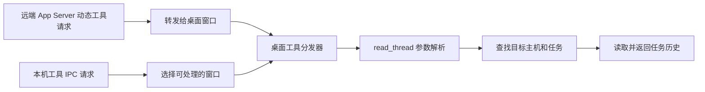

# Desktop 工具执行端授权入口核查

结论：**在本机 Codex Desktop 26.901.6511.0 已追踪的读取链路和本次检索的官方接口中，没有找到“按调用任务或项目限制原生工具读取目标、校验异常默认拒绝”的受支持接入点。**

这不是完整隔离已实现，也不是断言所有版本都无法实现。当前不能同时承诺“原有桌面操作方式和侧栏任务全部保留”与“全部工具的工作组强隔离”。继续增加 Skill、LangGraph 包装或普通钩子，不能补上原生入口缺少的目标授权。

本轮只核查文档和安装包代码，未创建新桌面测试任务，未再次读取合成标记，未改运行环境、全局权限或已安装 Skill。此前的 [Docker/SSH 反例](desktop-isolation-results-20260911.md) 与 [钩子故障反例](desktop-hooks-results-20260911.md) 原样保留；没有重开效率排名。

## 官方能力与实际缺口

| 能力 | 已确认的作用 | 与本次要求的差距 |
| --- | --- | --- |
| Permission profiles | 约束本地沙箱命令的文件系统和网络访问 | 不定义原生 `read_thread` 的目标任务或项目范围 |
| Apps / MCP 工具配置 | 连接器启停、工具清单和审批行为 | 没有找到可约束桌面动态读取目标的官方映射或策略字段 |
| 受管 Hooks | 固定配置并在正常执行时返回拒绝 | 上轮实际证明进程故障时仍会返回外组标记 |
| App Server 动态工具 API | 自建客户端接收 `item/tool/call` 并提供工具结果 | 自建客户端可以实现自己的授权；不等于能替换官方桌面客户端内部的执行函数 |

来源：[Permissions 的范围说明](https://learn.chatgpt.com/docs/permissions#scope-and-enforcement)、[配置参考](https://learn.chatgpt.com/docs/config-file/config-reference)、[动态工具调用 API](https://learn.chatgpt.com/docs/app-server#dynamic-tool-calls-experimental)。文档中的连接器工具策略不能仅凭名称相似就套用为 `codex_app.read_thread` 的项目授权。

官方检索围绕 Desktop 工具权限、managed requirements、dynamic tools、permission profiles、连接器工具开关，以及 `read_thread`/`hostId` 目标范围；没有找到对应的目标授权配置。结论是本次范围内未发现受支持入口，不把搜索无结果当作“平台永远没有此能力”的证明。

## 本机执行链

只读检查安装包，定位了两条到达桌面工具处理器的路线：

有以下具体发现：

1. **能力检查不等于目标授权。** `canCallTool` 对应的 `JSa` 检查调用方 host 和任务是否可用，部分工具还检查窗口角色。它没有解析被读取任务的项目范围。
2. **通用分发器有运行控制。** `NSa` 检查命名空间、重复调用、取消和部分窗口所有权条件；不能笼统说它“没有任何检查”。但 `read_thread` 分支调用 `jXi` 时，只传 scope、读取参数和 sourceHostId，没有将调用方任务/项目身份交给它作目标授权。
3. **hostId 是优先位置，不是隔离边界。** `jXi` 先用参数中的 hostId，省略时用调用方 host。`dJi → GH` 在优先主机未找到任务时，还可能搜索其它已连接主机。这是本轮源码发现，没有额外发起跨组运行测试。
4. **读取失败和缺少授权策略是两回事。** 参数错误、未找到任务、多个主机匹配或读取失败，代码会返回错误。缺口是尚未看到调用方和目标的项目授权判断；本轮没有声称所有运行时错误都会放行。
5. **自定义工具开关不能直接推定生效。** 本机还存在桌面自动生成 `mcp_servers.codex_app.enabled_tools` 的路径；远端动态工具与本机 MCP 路线有区别。没有证据证明手工添加同名配置，就能对两条入口统一施加目标级授权。

本轮核查的是同一桌面账户能访问的任务工具及已连接主机，不涉及读取其他用户账户或私人数据。完整安装包仅做关键词定位；关键函数链逐项核读，这不是整个安装包的安全审计。

## 代码证据定位

以下是对应版本安装包的文件名和 JavaScript UTF-16 字符偏移。压缩函数名和偏移可能随升级变化；升级后必须重新定位。原始代码仅保存在被 Git 忽略的本地核查目录，没有复制到发布内容。

| 安装包内文件 | 定位 | 观察 |
| --- | --- | --- |
| `.vite/build/main-DpnWwRdP.js` | `gie`，`tools/call` 附近 264273；`callDynamicAppTool` 附近 2605678 | IPC 解码、分发和窗口能力选择 |
| `.vite/build/src-VqXTPopo.js` | `item/tool/call` 附近 1065692 | 将远端工具请求转发给桌面窗口 |
| `webview/assets/app-initial-f87238153a19.js` | `NSa` 6947942；read 分支 6952077 | 工具分发及 `jXi` 调用参数 |
| 同上 | `jXi` 5987524；`dJi` 5933463；`GH` 5477502 | 目标参数解析、主机查找、历史读取 |
| 同上 | `LZi` 6003759；`canCallTool` 6963901 | 前置特殊工具分支与调用方可用性检查 |

本机 AppX 版本再次核实为 26.901.6511.0。所用 main、src、app-initial 文件 SHA-256 分别是：

- `2863c5b445ee465a1943e9ef431c824d1b0dd78fa72d11790bb53f5ee8bc67bb`
- `8d056524ea3f5714e5e0a254afd88f018d58465bc6ea026adee3c80ff7799e29`
- `44ceeb9cadac569f6217e288c0e09fceeca712d749862887ea36baf6019ea966`

## Reuse Decision

Decision: Blocked

### Evidence
- Project search: `src/desktop.mjs` 仅约束经 Workbench 包装的调用，无法控制模型直接使用的桌面原生入口。
- Official search: 上述官方配置和 App Server 文档没有提供满足本次合同的桌面目标授权扩展。
- License: 未引入第三方实现；安装包代码仅作本地只读核查，不推定其开源许可，不复制或发布实现。
- Maintenance: 本机版本与源码哈希已记录。直接修改压缩安装包会产生版本维护问题，并非本轮授权的实现方式。
- Compatibility: 自建 App Server 客户端可控制自己的工具执行，但“官方桌面真实侧栏任务仍为受控执行者”尚无受支持的接入证据。
- Verification: 本轮为文档与源代码证据；运行时证据仍引用上一轮真实故障测试。没有用本地模拟网关的成功代替桌面隔离成功。

### Rationale

阻塞点是缺少满足桌面使用约束的受支持授权接入合同。没有选择修改安装包、注入桌面前端、伪装任务身份或创建一个额外网关来声称问题已解决。

### Next step

保留当前 Skill/RAG/LangGraph 的项目协作能力，将“完整工具强隔离”明确列为平台依赖。普通功能与交付质量验证可以按其自身授权继续；公平盲测和跨项目保密保证仍须等隔离边界通过。

如果坚持全部工程师都在现有官方桌面任务中执行，下一步应先确认平台是否提供目标授权扩展或能增加该能力。独立客户端/系统环境可以作为替代路线进一步评估，但它可能改变操作方式，不能在用户硬性要求未改变时冒充完成。

## 待确认的最小平台能力

以下内容可作为功能诉求或最小复现说明，**尚未向外部提交**：

> 需要在保留 Codex Desktop 项目侧栏任务的前提下，为原生工具设置不可由工程师修改的任务/项目作用域。已完成的合成实验表明，独立 SSH 容器仍能经 `read_thread` 取得另一组任务标记；受管 PreToolUse 正常 deny 有效，但其进程异常退出后，该读取仍成功。希望确认是否有受支持的工具执行端授权入口。

最低验收合同：

1. 调用身份来自受信任执行上下文；模型参数和环境变量不能自行扩大授权。
2. 返回任何内容前，将实际解析出的目标任务、项目和主机与授权范围核对；host 查找回退不能扩大范围。
3. 缺规则、身份不明、策略服务失败或超时均不返回目标内容；记录明确的拒绝原因。
4. 动态工具、MCP/本机 IPC、任务引用，以及其它可返回任务内容的入口使用一致规则；工具重新发现不恢复禁用权限。
5. 委派、接续和重连继承既定范围；工程师无法修改规则或受信任审计记录。
6. 使用干净的合成任务验证本组允许、跨组拒绝、省略参数、失败场景及侧栏接续。未覆盖入口仍标记未验证。

该合同是后续实现必须达到的行为，当前没有实现或验证它。
